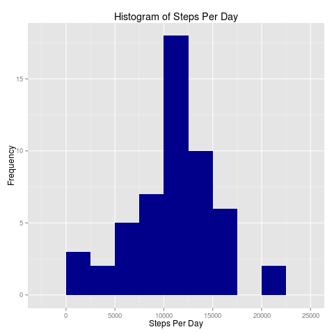
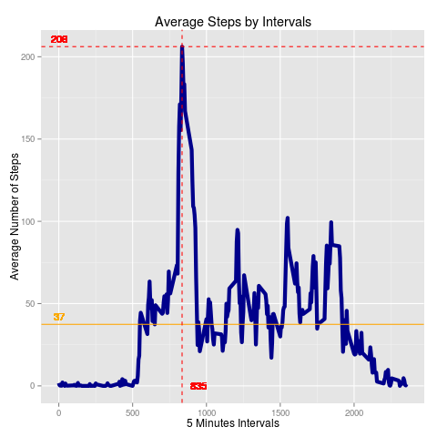
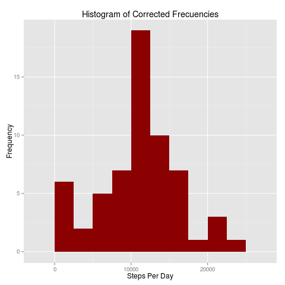
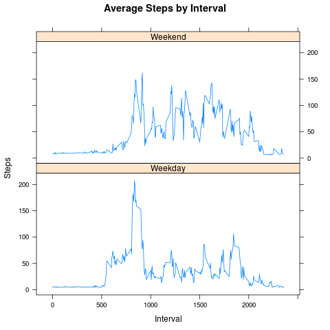

# Reproducible Research
## Analysing Activity Datasets
Peer evaluated Project 01

Harold A. Cruz-Sanchez  
April, 2015  

###About
It is now possible to collect a large amount of data about personal movement using activity monitoring devices such as a [Fitbit](http://www.fitbit.com), [Nike Fuelband](http://www.nike.com/us/en_us/c/nikeplus-fuelband), or [Jawbone Up](https://jawbone.com/up).  These type of devices take measurements that allows the user to find patterns in their activity behavior.  Lots of raw data can be obtained, but there is, still, a lack of statistical methods and software  processing and interpreting it.  

The development of a program that makes basic analysis of the data obtained, was done with the use of the "R" programming.  Other researchers may reproduce the obtained results by following the script.  This is part of the [Coursera](coursera.org), and University of John Hopkins course **Reproducible Research**, as part of  Data Science Specialization.


##Purpose of the Project
There are three areas of interest at the time of developing this project, each of them is a requisite for the next one:

* Data loading and preprocessing
* Data analysis
* Interpretation of results

As final part, there is a set of question related to the previous three steps to be addressed.

## Data
The data used in this project is available and free to be downloaded from the course web
site:

* Dataset: [Activity monitoring data](https://d396qusza40orc.cloudfront.net/repdata%2Fdata%2Factivity.zip) [52K]

The variables included in this dataset are:

* **steps**: Number of steps taking in a 5-minute interval (missing
    values are coded as `NA`)

* **date**: The date on which the measurement was taken in YYYY-MM-DD
    format

* **interval**: Identifier for the 5-minute interval in which
    measurement was taken

The dataset is stored in a comma-separated-value (CSV) file and there are a total of 17,568 observations in this dataset.

## Data loading and preprocessing

Download, unzip and load data into data frame `my_data`. 

```r
if(!file.exists("getdata-projectfiles-UCI HAR Dataset.zip")) {
        temp <- tempfile()
        download.file("http://d396qusza40orc.cloudfront.net/repdata%2Fdata%2Factivity.zip",temp)
        unzip(temp)
        unlink(temp)
}

my_data_00 <- read.csv("activity.csv", header = TRUE, sep = ",", quote = "\"",
                       dec = ".", fill = TRUE,)
```
Once the dataset is loaded, we can start with the preprocessing.  First a summary of the dataset:

```r
summary(my_data_00) # Summary 

#      steps             date               interval     
#  Min.   :  0.00   Min.   :2012-10-01   Min.   :   0.0  
#  1st Qu.:  0.00   1st Qu.:2012-10-16   1st Qu.: 588.8  
#  Median :  0.00   Median :2012-10-31   Median :1177.5  
#  Mean   : 37.38   Mean   :2012-10-31   Mean   :1177.5  
#  3rd Qu.: 12.00   3rd Qu.:2012-11-15   3rd Qu.:1766.2  
#  Max.   :806.00   Max.   :2012-11-30   Max.   :2355.0  
#  NA's   :2304               
``` 
Once we corroborate that the dataset is ready to be processed, we can create a copy to be preprocessed, and at the same time, we can add the `weekday` variable

```r
library(dplyr)

my_data_01 <-cbind(my_data_00,"weekday"=(weekdays(as.Date(my_data_00$date))))

summary(my_data_01)

#     steps             date               interval           weekday    
#  Min.   :  0.00   Min.   :2012-10-01   Min.   :   0.0   Friday   :2592  
#  1st Qu.:  0.00   1st Qu.:2012-10-16   1st Qu.: 588.8   Monday   :2592  
#  Median :  0.00   Median :2012-10-31   Median :1177.5   Saturday :2304  
#  Mean   : 37.38   Mean   :2012-10-31   Mean   :1177.5   Sunday   :2304  
#  3rd Qu.: 12.00   3rd Qu.:2012-11-15   3rd Qu.:1766.2   Thursday :2592  
#  Max.   :806.00   Max.   :2012-11-30   Max.   :2355.0   Tuesday  :2592  
#  NA's   :2304  					  Wednesday:2592 
```
## 1. What is mean total number of steps taken per day?
### 1.1. Calculate the total number of steps taken per day

To calculate the total number of steps in a given day, first we should make sure to add the days of the week related to the "date" in the raw data, using the 'weekday' function
```r
 steps_per_date <- my_data_01 %>%
  filter(!is.na(steps)) %>%
  group_by(date) %>%
  summarize(steps = sum(steps)) %>%
  print

#Source: local data frame [53 x 2]
# date steps
# 1  2012-10-02   126
# 2  2012-10-03 11352
# 3  2012-10-04 12116
# 4  2012-10-05 13294
# 5  2012-10-06 15420
# 6  2012-10-07 11015                                        
```
### 1.2. Make a histogram of the total number of steps taken each day

Histogram of total steps taken per day. The resulting file will be saved as png file


```r
library(ggplot2)

Hist_01<- ggplot(steps_per_date, aes(x = steps)) +
  geom_histogram(fill = "darkblue", binwidth = 2500) +
  labs(title = "Histogram of Steps Per Day", x = "Steps Per Day", y = "Frequency")
print(Hist_01)
dev.copy(png, file="Hist_01.png", height=480, width=480)
dev.off()
```

 

### 1.3. Calculate and report the mean and median of thetotal number of steps taken per day


```r
summary(steps_per_date)

#      date                steps      
#  Min.   :2012-10-02   Min.   :   41  
#  1st Qu.:2012-10-16   1st Qu.: 8841  
#  Median :2012-10-29   Median :10765  
#  Mean   :2012-10-30   Mean   :10766  
#  3rd Qu.:2012-11-16   3rd Qu.:13294  
#  Max.   :2012-11-29   Max.   :21194 
 
steps_per_day_mean <- mean(steps_by_date$steps)
# [1] 10766

steps_per_day_median <- median(steps_by_date$steps)
# [1] 10765
```

The `mean` is 10766 and the `median` is 10765.


## 2. What is the average daily activity pattern?
### 2.1. Make a time series plot (i.e.type = "l") of the 5-minute interval (x-axis) and the average number of steps taken, averaged across all days (y-axis)

Average number of steps by each intervals

```r
Average_intervals_01 <- my_data_01 %>%
  filter(!is.na(steps)) %>%
  group_by(interval) %>%
  summarize(steps = mean(steps)) %>%
  print

summary(Average_intervals_01)

#    interval          steps        
#  Min.   :   0.0   Min.   :  0.000  
#  1st Qu.: 588.8   1st Qu.:  2.486  
#  Median :1177.5   Median : 34.113  
#  Mean   :1177.5   Mean   : 37.383  
#  3rd Qu.:1766.2   3rd Qu.: 52.835  
#  Max.   :2355.0   Max.   :206.170

```
Plot of the average steps by intervals. The resulting file will be saved as png file

```r
Average_Intervals <- ggplot(Average_intervals_01, aes(x=interval, y=steps)) +
  geom_line(color = "darkblue", size = 2)+
  # Maximum value of average steps
  geom_hline(yintercept=max(Average_intervals_01$steps), colour="red", linetype="dashed") +
  geom_text(aes(0,max(Average_intervals_01$steps),label =round(max(Average_intervals_01$steps)), vjust=-0.5), colour="red", size=4) +
  # Mean of steps by interval
  geom_hline(yintercept=mean(Average_intervals_01$steps), colour="orange") +
  geom_text(aes(0,mean(Average_intervals_01$steps),label = round(mean(Average_intervals_01$steps)), vjust=-0.5), colour="orange", size=4) +
  # Interval with the maximum value of steps
  geom_vline(xintercept=(as.numeric(Average_intervals_01[which.max(Average_intervals_01$steps),1])), colour="red", linetype="dashed") +
  geom_text(aes((as.numeric(Average_intervals_01[which.max(Average_intervals_01$steps),1])),0,label = round((as.numeric(Average_intervals_01[which.max(Average_intervals_01$steps),1]))), hjust=-0.5), colour="red", size=4) +
  labs(title = "Average Steps by Intervals", x = "5 Minutes Intervals", y = "Average Number of Steps")
print(Average_Intervals)
dev.copy(png, file="Average_Intervals.png", height=480, width=480)
dev.off()
```



### 2.2. Which 5-minute interval, on average across all the days in the dataset, contains the maximum number of steps?


```r
Average_intervals_01[which.max(Average_intervals_01$steps),]

# Source: local data frame [1 x 2]
# interval    steps
# 1      835 206.1698

```

The 5-minute interval, on average across all the days in the data set, containing the maximum number of steps is the `835` interval, containing in average `206.1698` steps .

## 3. Impute missing values. Compare imputed to non-imputed data.
### 3.1. Calculate and report the total number of missing values in the dataset (i.e. the total number of rows with NAs)

To calculate and report the total number of missing values in the dataset, we can request a summary of the raw data, which includes that value. The number of missing records, in this case, is `2304`. 

```r
summary(my_data_00)
# steps             date               interval     
# Min.   :  0.00   Min.   :2012-10-01   Min.   :   0.0  
# 1st Qu.:  0.00   1st Qu.:2012-10-16   1st Qu.: 588.8  
# Median :  0.00   Median :2012-10-31   Median :1177.5  
# Mean   : 37.38   Mean   :2012-10-31   Mean   :1177.5  
# 3rd Qu.: 12.00   3rd Qu.:2012-11-15   3rd Qu.:1766.2  
# Max.   :806.00   Max.   :2012-11-30   Max.   :2355.0  
# NA's   :2304  <<== The number of NA's should go down to zero   

sum(is.na(my_data_00$steps))  # number of missing values in rows
# [1] 2304
```
This information is corroborated by the 'sum' function, applied to the `NA` values. 

### 3.2. Devise a strategy for filling in all of the missing values in the dataset.

NA values create a distraction to the main goal of finding patters, and we would like to simply clean the dataset so it could be analyzed as if there were no missingness. Any strategy devised to filling the missing values must balance randomness and other (un)observed predictors.

Here, we have, at least, four option to handle the NA values in the dataset:

* 1. To avoid counting those records.  This will decrease the reliability of the analysis
* 2. To change all the NA records for the Zero value. This option may affect negativaly the reliability of the analysis
* 3. To change each NA record for the mean value of other records with similar conditions (predictors)
* 4. To use random values.  

Using the option number 3, we can create a new dataset similar to the original, but with all missing data filled in.

```r
summary(my_data_00) # Original data, raw data 

#      steps             date               interval     
#  Min.   :  0.00   Min.   :2012-10-01   Min.   :   0.0  
#  1st Qu.:  0.00   1st Qu.:2012-10-16   1st Qu.: 588.8  
#  Median :  0.00   Median :2012-10-31   Median :1177.5  
#  Mean   : 37.38   Mean   :2012-10-31   Mean   :1177.5  
#  3rd Qu.: 12.00   3rd Qu.:2012-11-15   3rd Qu.:1766.2  
#  Max.   :806.00   Max.   :2012-11-30   Max.   :2355.0  
#  NA's   :2304                               
summary(my_data_01) # modified original data. Variable 'weekdays' had been added 

#     steps             date               interval           weekday    
#  Min.   :  0.00   Min.   :2012-10-01   Min.   :   0.0   Friday   :2592  
#  1st Qu.:  0.00   1st Qu.:2012-10-16   1st Qu.: 588.8   Monday   :2592  
#  Median :  0.00   Median :2012-10-31   Median :1177.5   Saturday :2304  
#  Mean   : 37.38   Mean   :2012-10-31   Mean   :1177.5   Sunday   :2304  
#  3rd Qu.: 12.00   3rd Qu.:2012-11-15   3rd Qu.:1766.2   Thursday :2592  
#  Max.   :806.00   Max.   :2012-11-30   Max.   :2355.0   Tuesday  :2592  
#  NA's   :2304                                           Wednesday:2592 
```

### 3.3. Create a new dataset that is equal to the original dataset but with the missing data filled in.


Now we can fill all the `NA` values. The records with missing values would be replaced with the average value of records with similar characteristics, in this case, the same interval. The change increased the mean of the steps. 

```r
my_data_NONA <- my_data_01

my_data_no_na_01 = merge(my_data_NONA, Average_intervals_01, by="interval", suffixes=c(".nna", ".int"))

no_NA = which(is.na(my_data_01$steps))

my_data_NONA[no_NA,"steps"] = my_data_no_na_01[no_NA,"steps.int"]

summary(my_data_NONA) 

#      steps             date               interval           weekday    
#  Min.   :  0.00   Min.   :2012-10-01   Min.   :   0.0   Friday   :2592  
#  1st Qu.:  0.00   1st Qu.:2012-10-16   1st Qu.: 588.8   Monday   :2592  
#  Median :  0.00   Median :2012-10-31   Median :1177.5   Saturday :2304  
#  Mean   : 37.81   Mean   :2012-10-31   Mean   :1177.5   Sunday   :2304  
#  3rd Qu.: 29.00   3rd Qu.:2012-11-15   3rd Qu.:1766.2   Thursday :2592  
#  Max.   :806.00   Max.   :2012-11-30   Max.   :2355.0   Tuesday  :2592  
#                                                         Wednesday:2592
```

### 3.4. Make a histogram of the total number of steps taken each day and Calculate and report the mean and median total number of steps taken per day.

To create the histogram, first we need to calculated the total number of steps taken each day

```r
steps_NONA <- my_data_NONA %>%
  filter(!is.na(steps)) %>%
  group_by(date) %>%
  summarize(steps = sum(steps)) %>%
  print

summary(steps_NONA)
#       date                steps      
# Min.   :2012-10-01   Min.   :   41  
# 1st Qu.:2012-10-16   1st Qu.: 8821  
# Median :2012-10-31   Median :11015  
# Mean   :2012-10-31   Mean   :10890  
# 3rd Qu.:2012-11-15   3rd Qu.:13460  
# Max.   :2012-11-30   Max.   :24150 

steps_NONA[which.max(steps_NONA$steps),]
# Source: local data frame [1 x 2]
# date    steps
# 1 2012-11-10 24149.72

mean(steps_NONA$steps)
# [1] 10889.8
```
Histogram of the average steps by intervals, when the `NA` values where replaced. The resulting file will be saved as png file

```r
Hist_corrected_01 <- ggplot(steps_NONA, aes(x = steps)) +
  geom_histogram(fill = "darkred", binwidth = 2500) +
  labs(title = "Histogram of Corrected Frecuencies", x = "Steps Per Day", y = "Frequency")
print(Hist_corrected_01)
dev.copy(png, file="Hist_Corrected_Frecuencies_01.png", height=480, width=480)
dev.off()
```



### 3.4a. Do these values differ from the estimates from the first part of the assignment?


```r
corrected_steps_NONA_mean <- mean(steps_NONA$steps) - mean(steps_per_date$steps)
# [1] 123.6106

corrected_steps_NONA_median <- median(steps_NONA$steps) - median(steps_per_date$steps)
# [1] 250
```
The `mean` increased its value in `123.6106 steps, while the `median` increased its value in `250` steps.

### 3.4b. What is the impact of imputing missing data on the estimates of the total daily number of steps?

There is a important change in the assumptions at the time of imputting missing data. Filling the missing data `NA` with the averages of steps, increases the viability to find patters by creating a cleaner dataset. For additional information about missing data and imputing data we can check the book [*Data Analysis Using Regression and Multilevel/Hierarchical Models*](http://www.stat.columbia.edu/~gelman/arm), by Andrew Gelman and Jennifer Hill. [missing.pdf](http://www.stat.columbia.edu/~gelman/arm/missing.pdf) [572 Kb]

## 4. Are there differences in activity patterns between weekdays and weekends?

For this part the `weekdays()` function may be of some help here. Use the dataset with the filled-in missing values for this part.


### 4.1. Create a new factor variable in the dataset with two levels – “weekday” and “weekend” indicating whether a given date is a weekday or weekend day.

```r
weekdays <- c("Monday", "Tuesday", "Wednesday", "Thursday", 
              "Friday")
test_weekdays <- my_data_NONA
test_weekdays$day_of_week = as.factor(ifelse(is.element(weekdays(as.Date(test_weekdays$date)),weekdays), "Weekday", "Weekend"))
Average_steps_by_Intervals_weekday <- aggregate(steps ~ interval + day_of_week, test_weekdays, mean)
```
### 4.2. Make a panel plot containing a time series plot (i.e. type = "l") of the 5-minute interval (x-axis) and the average number of steps taken, averaged across all weekday days or weekend days (y-axis).

Plot comparing the average steps by intervals in regular weekdays and weekends, when the `NA` values where replaced. The resulting file will be saved as png file

```r
library(lattice)
Differences <- xyplot(Average_steps_by_Intervals_weekday$steps ~ Average_steps_by_Intervals_weekday$interval|
         Average_steps_by_Intervals_weekday$day_of_week, main="Average Steps by Interval",
       xlab="Interval", ylab="Steps",layout=c(1,2), type="l")
print(Differences)
dev.copy(png, file="Difference_in_Patterns_01.png", height=480, width=480)
dev.off()
```



